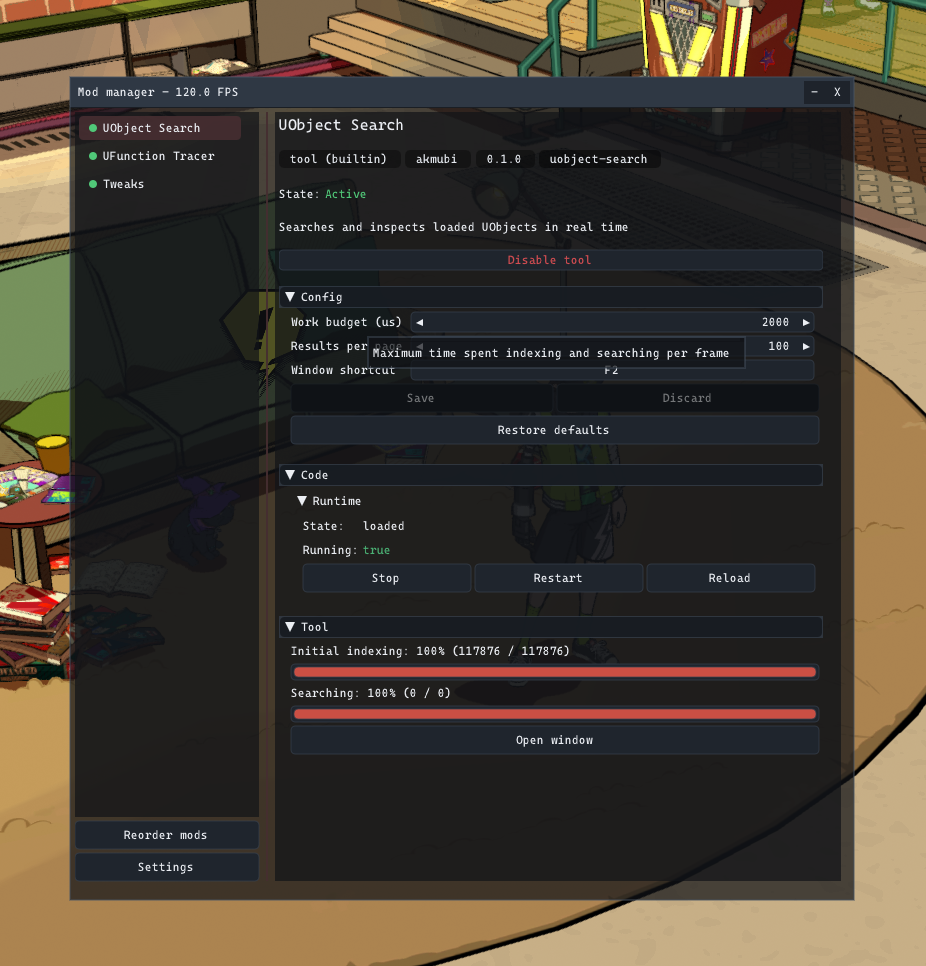
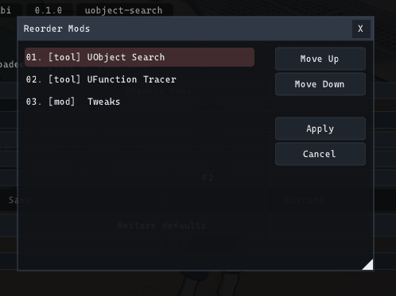
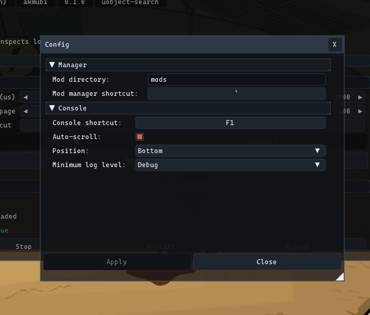
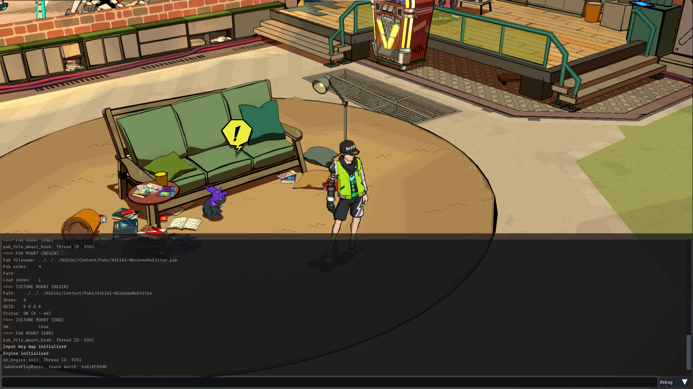
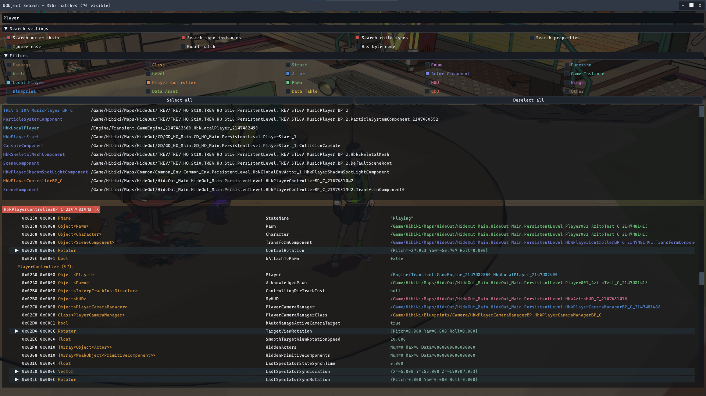
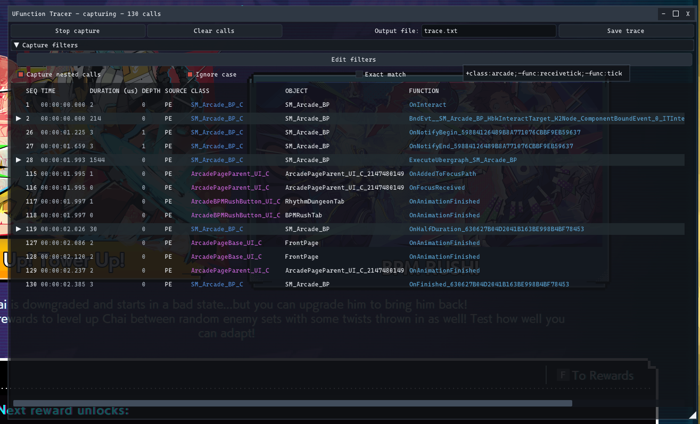

# Overdub

Overdub is a mod loader and in-game mod manager for Hi-Fi RUSH. It supports native DLL mods, Unreal asset mods, Blueprint actors, mod options, and built-in tools for inspecting the game.

## Features

- Native C mod API with game callbacks, input handling, Unreal helpers, hooks, commands, custom UI, and managed memory.
- DLL mods can be started, stopped, restarted, unloaded, and reloaded while the game is running.
- A single mod can contain DLL code, asset files, Blueprint actors, options, or any mix of them.
- Mod options and keybinds are shown in the manager without each mod needing to build its own settings window.
- Blueprint actors can be spawned automatically, by keybind, or from the manager.
- Runtime state and errors are shown separately for DLL code, assets, and Blueprint actors.
- Built-in UObject Search, object details, Kismet bytecode disassembly, UFunction Tracer, console, and a few game tweaks.
- The same loader works on Windows and through Proton on Linux and Steam Deck.

It supports:
- Windows x64
- Linux x64 through Proton, including Steam Deck
- Steam
- Epic Games
- Xbox and Game Pass

## Quick Start

### 1. Installation

Download the release for your version of the game. The release contains:

- `overdub.dll`
- A Hibiki Bootstrap DLL

Copy both files into the game directory.

Steam and Epic Games:

```
<game>/Hibiki/Binaries/Win64/
|-- overdub.dll
+-- XAPOFX1_5.dll
```

Xbox and Game Pass:

```
<game>/Hibiki/Binaries/WinGDK/
|-- overdub.dll
+-- dsound.dll
```

Linux and Steam Deck use the same files and the same installation steps. Install them into the Windows game directory used by Proton. No DLL override or extra launch option is required.

The exact game directory depends on the store version. See [Hibiki Bootstrap](https://github.com/akmubi/hibiki-bootstrap) for more information.

Do not keep UE4SS or another proxy DLL loader in the same directory.

### 2. Start the game

On the first launch, it should create these files in the same game directory:

```
overdub.log
overdub-config.ini
mods/
```

Use these keys in-game:

| Key               | Action                        |
|-------------------|-------------------------------|
| Backtick, `` ` `` | Open or close the mod manager |
| F1                | Open or close the console     |

If `overdub.log` and `mods` are not created, Overdub was not loaded. Check the installation path and make sure the bootstrap DLL matches your game version.

### 3. Install mods

Every mod must have its own directory inside `mods`. Each mod needs at least a `mod.ini` (manifest file).

```
mods/
+-- example-mod/
    |-- mod.ini
    |-- main.dll
    +-- ...
```

Asset mods may also contain `.pak`, `.utoc`, and `.ucas` files.

Extract mod archives before starting the game. Restart the game after adding a new mod. Overdub does not discover new mod directories while the game is already running.

That is all that is needed for normal use. Open the manager, select a mod, and check its state, options, and controls.

## Using the Mod Manager

The left side contains the mod list. The right side shows information and controls for the selected mod.

The dot beside a mod shows its general state:

- Green: at least one part of the mod is active.
- Gray: the mod is inactive.
- Red: DLL code, assets, or a Blueprint actor reported an error.

A mod can contain several parts. For example, its DLL may be running while one of its Blueprint actors has failed. Open the sections on the right to see the exact state.



### Mod Information

The top of the panel shows the mod name, kind, author, version, ID, description, and general state.

The remaining sections depend on what the mod contains:

- `Config` shows mod options and Blueprint settings.
- `Code` shows DLL information and runtime controls.
- `Assets` shows asset paths, mount state, priority, and errors.
- `Blueprints` shows declared actors and their current instances.
- Some DLL mods may add their own panel below the standard sections or even provide their own `Config` section.

### Enable and Disable

The `Enable` and `Disable` button controls the whole mod.

For DLL code and Blueprint actors, the change is applied immediately:

- Disabling unloads the DLL and despawns tracked Blueprint actors.
- Enabling loads and starts the DLL and starts Blueprint actors that use auto-spawn.

Asset files cannot be safely mounted or unmounted while the game is running. If a mod contains assets, restart the game after enabling or disabling it. Its mounted assets may remain active until the game closes.

Disabling a mod also cannot always undo changes that the mod already made to the game.

### Mod Options

Changes made in the `Config` section update the current in-memory values immediately. Whether the mod reacts immediately depends on how that mod is written.

- `Save` writes the current values to the mod's `config.ini`.
- `Discard` restores the last saved values.
- `Restore defaults` changes the values back to defaults. Press `Save` if you want to keep them.

If a saved option does not take effect, use `Restart` for the DLL mod or restart the game. Blueprint auto-spawn changes also need the Blueprint or mod to be started again.

### DLL State and Controls

The `Code` section shows two separate values:

- `State` tells whether the DLL is loaded into the process.
- `Running` tells whether the mod has completed its initialization and is active.

Common states:

- `unloaded`: the DLL is not loaded.
- `loaded`, `Running: false`: the DLL is loaded but its mod code is stopped.
- `loaded`, `Running: true`: the DLL is loaded and active.

If loading or initialization fails, the same section shows an error message.

Controls:

- `Start` loads the DLL if needed and calls its initialization function.
- `Stop` calls its shutdown function and removes runtime resources managed by Overdub. The DLL stays loaded.
- `Restart` performs `Stop`, then `Start`.
- `Reload` performs `Stop`, `Unload`, `Load`, then `Start`.

`Reload` is mainly for quick mod testing. Reloading a mod that does not support clean shutdown may crash the game.

Reloading only replaces DLL code. It does not reload the manifest, discover new mods, or remount assets.

### Asset Mods

The `Assets` section shows:

- PAK, UTOC, and UCAS paths
- Mount state
- Mount priority
- Mount error, if any

Assets are mounted during startup. They cannot be freely mounted or unmounted later.

Restart the game after:

- Enabling or disabling an asset mod
- Updating its asset files
- Changing mod order
- Removing the mod

When two asset mods replace the same game file, the mod lower in the order has a higher mount priority and normally takes precedence.

### Blueprint Mods

The `Blueprints` section has two parts.

`Blueprint definition` shows the class path, spawn context, custom context when used, and default keybind.

`Runtime` shows whether the actor is active, its current object address, and any spawn error.

- `Spawn` creates the actor using its configured context.
- `Despawn` removes the currently tracked actor.
- `Auto spawn` starts the actor when the mod starts.
- `Spawn keybind` allows manual spawning while the mod is active.

Spawning can fail when the required world, player, controller, pawn, or custom object is not available yet.

### Mod Order

Press `Reorder mods` below the mod list, select a mod, and use `Move Up` or `Move Down`.

- `Apply` saves the new order.
- `Cancel` closes the window without applying it.

The runtime order is fixed when Overdub starts, so restart the game after changing it.

Order affects:

- DLL startup order
- Callback and input processing order
- Asset mount priority

DLL callbacks are processed from the top of the list to the bottom. Asset priority increases down the list, so a lower asset mod normally overrides a higher one when both replace the same path.

Changing the order does not make incompatible mods compatible.



### Manager Settings

Press `Settings` below the mod list.

Manager settings:

- `Mod directory`: the directory Overdub scans for mods.
- `Mod manager shortcut`: the key used to open and close the manager window.

Console settings:

- `Console shortcut`
- `Auto-scroll`
- `Position`
- `Minimum log level`

Press `Apply` to save changes to `overdub-config.ini`. `Close` does not save them to disk. Unsaved values may still affect the current session and are lost after restarting the game.

Changing the mod directory needs a game restart because mod discovery only happens during startup.



## Configuration Files

Overdub stores loader settings in:

```
overdub-config.ini
```

Each mod stores its own values in:

```
mods/<mod-directory>/config.ini
```

Built-in tools also use mod configuration files. Overdub may create directories such as `mods/builtin.uobject-search/` for them.

Configuration files are managed by Overdub. Edit them manually only when the game is closed and only when you understand the format. Invalid values or keybinds may stop a setting from loading. The game may also overwrite manual changes if the file is edited while it is running.

Keep a backup before changing configuration files by hand.

## Console

Press F1 to open the console.

The console shows Overdub and mod log messages. Mods can also register commands that are entered through the console.

Its settings control the shortcut, auto-scroll, screen position, and minimum visible log level. The console only shows the current session. Use `overdub.log` when reporting a problem or checking earlier startup messages.



## Built-in Tools

Built-in tools appear in the normal mod list. Select a tool to change its settings or open its window.

### UObject Search

UObject Search inspects Unreal objects that are currently loaded in memory. Its default shortcut is F2.

The tool first builds an index of live objects. Its title and panel show indexing and search progress. The work budget setting limits how much indexing and searching it does per frame. A larger value finishes faster but may cause more frame time spikes.

Enter text in the search field to start searching. `Search settings` can also search:

- Outer chains
- Instances of a matching type
- Child types
- Property names
- Bytecode functions only
- Exact or case-insensitive names

`Filters` limits visible results by object kind. Select a result to open it in the details panel. Use the result pages when there are more matches than the configured page size.

The details panel can show object identity, class and outer information, properties, functions, type data, and Kismet bytecode when available.

The details panel uses preview and pinned tabs. Selecting a search result opens it in the preview tab. The next selected result reuses that tab. Click the tab itself to pin it. Linked objects in the details panel can also be opened from the context menu with `Open in new tab`.

Tab shortcuts work while the UObject Search details panel accepts input:

| Shortcut   | Action                  |
|------------|-------------------------|
| `Tab`      | Select the next tab     |
| `Ctrl+Tab` | Select the previous tab |
| `Ctrl+W`   | Close the selected tab  |

Current limits:

- Full names cannot currently be searched as one path. For example, `/Script/Engine.CoreUObject` does not work as a full-name query. Search for a short name such as `CoreUObject` instead.
- The details panel is read-only.
- Property values cannot be changed.
- Functions cannot be called.
- Objects can disappear when the game destroys them.
- Broad property or outer-chain searches can be slow.
- The Kismet disassembler output is very verbose and hard to read.

The search tool will be improved in future releases.



### UFunction Tracer

UFunction Tracer records Unreal function calls while capture is active.

Basic use:

1. Open the tracer window.
2. Open `Capture filters` and add a narrow filter.
3. Press `Start capture`.
4. Perform the action in the game.
5. Press `Stop capture`.
6. Expand captured calls to inspect nested calls.
7. Enter an output path and press `Save trace` to dump the capture into a text file.
8. Use `Clear calls` before the next test.

The table shows sequence number, time, duration, depth, capture source, class, object, and function. `Capture nested calls` records calls made inside another captured call.

Capture filters use include and exclude rules. Separate rules with semicolons or line breaks:

```text
+target:text
-target:text
```

`+` includes a match and `-` excludes it. When the target is omitted, the rule uses `func`.

| Target          | Matches                                |
|-----------------|----------------------------------------|
| `func`          | Function name                          |
| `func_outer`    | Function outer chain                   |
| `self`          | Object name                            |
| `self_outer`    | Object outer chain                     |
| `class`         | Object class name                      |
| `class_outer`   | Class outer chain                      |
| `class_inherit` | Object class and its inheritance chain |

Examples:

```text
+OnBeat
```

This is the same as `+func:OnBeat`.

```text
+class_inherit:Actor
-func:Tick
-self:Default__
```

This captures calls on actors and actor subclasses, except matching Tick functions and default objects.

Include rules are combined with OR. A call only needs to match one include rule. Any matching exclude rule rejects the call. With only exclude rules, every other call passes. With no valid rules, every call passes.

Matching uses substring search by default. `Ignore case` and `Exact match` change matching for the whole filter. `Capture nested calls` records calls made inside a captured call without requiring every nested call to match the filter.

Current limits:

- Parameters and return values are not saved.
- The capture filter is still limited and is easy to make too broad.
- Busy functions can fill the capture limit very quickly.
- Broad tracing can lower performance.
- The call counter may increase much faster than the list is useful to read.
- Captured object pointers may no longer be valid after the object is destroyed.

Start with a narrow function filter and only enable nested calls when needed.

The tracer will also be improved in future releases.



### Tweaks

The Tweaks tool currently includes:

- Disable tutorials
- Restore jukebox state

This list is still small and may grow in later releases.

The jukebox option saves and restores the selected music, playback state, repeat mode, and shuffle state.

Be careful when using jukebox restore between different save slots. Its saved state is not limited to the slot where it was created. Opening another save can restore music there, including music that has not been unlocked in that save yet.

## Troubleshooting

### Overdub does not load

Check that:

- `overdub.dll` and the bootstrap DLL are in the same game directory.
- You installed the correct bootstrap for Steam, Epic Games, or Xbox.
- UE4SS is not installed.
- No other proxy DLL loader remains in the directory.

If `overdub.log` and `mods` are not created, the bootstrap did not load Overdub.

### The manager does not open

- Press the backtick key, not the apostrophe key.
- Check your keyboard layout.
- Try F1 and check the console for errors.
- Check `overdub-config.ini` if the shortcut was changed.
- Wait until the game has finished its initial loading (or loading between levels).

### A mod does not appear

- Make sure it has its own directory under `mods`.
- Make sure the directory contains `mod.ini`.
- Check that files named by the manifest exist.
- Restart the game after installing it.
- Check `overdub.log` for manifest errors.
- Make sure two mods do not use the same mod ID.

### A DLL mod does not start

Open its `Code` section and read the error text. Also check `overdub.log`.

Common causes include a wrong DLL path, the wrong CPU architecture, an unsupported mod API version, or a failed mod initialization.

### An asset mod does not work

Check its `Assets` section for the mount state and error. Make sure the PAK, UTOC, and UCAS files named by the manifest exist.

Restart the game after changing the mod, its enabled state, or its order.

### Fatal Error or assertion

When Overdub shows a Fatal Error message box, it copies the stack trace to the clipboard. Assertions also copy their stack trace.

Before launching the game again:

1. Paste the complete stack trace into a text file.
2. Save or copy `overdub.log`.
3. Write down what you were doing before the error.
4. Test again without the newest mod when possible.

The log may contain an earlier error that explains the crash.

## Reporting Problems

Search existing issues before opening a new one. Problems caused only by a third-party mod should normally be reported to that mod's author.

Use a clear title, for example:

```
[Steam][Windows] Crash when opening UObject Search
```

Include this information:

```markdown
## Problem

What happened, and what did you expect to happen?

## Steps to reproduce

1.
2.
3.

## Environment

- Overdub version:
- Game version:
- Store: Steam / Epic Games / Xbox
- OS:
- Proton version, if using Linux:
- Steam Deck: Yes / No

## Installed mods

List every installed mod and its version.

Does the problem still happen with third-party mods removed?

## Stack trace

Paste the complete stack trace copied by the Fatal Error or assertion handler.

## Log

Attach `overdub.log`.

## Extra information

Add screenshots, video, or save slot details when useful.
```

Please report one problem per issue. Do not upload game files or another author's full mod package.

## Known Limitations

- The discovered mod list is fixed at startup. Restart the game after adding or removing a mod.
- Manifest data, assets, Blueprints, and option definitions are loaded at startup.
- DLL code can be reloaded for testing, but safe reload depends on the mod cleaning up all of its state.
- DLL reload does not reload assets or turn an existing directory into a newly discovered mod.
- Mounted assets cannot be freely unloaded. Asset changes require a game restart.
- The built-in inspection tools are read-only.

## Mod Development

Mod development is covered in the separate [Mod Development Guide](docs/MOD_DEVELOPMENT.md).

It will cover the package layout, `mod.ini`, native DLL API, Unreal helpers, callbacks, options, custom UI, reload rules, and example mods.

## Building From Source

### Windows

1. Clone the repository.
2. Open `overdub.sln` in Visual Studio 2022.
3. Select `Release` and `x64`.
4. Build the solution.

The output is:

```
build/overdub.dll
```

The Visual Studio project has a post-build copy step for a Steam installation path. Change or disable that step if the game is installed somewhere else.

### Linux

The Linux build cross-compiles a Windows x64 DLL for use through Proton.

Install `make` and MinGW-w64, then run:

```sh
make release
```

The output is:

```
build/overdub.dll
```

For a debug build:

```sh
make debug
```

No native Linux library is produced. Copy the resulting Windows DLL into the game directory using the normal installation instructions.

## Uninstalling

Close the game, then remove:

- `overdub.dll`
- `XAPOFX1_5.dll` or `dsound.dll`

Remove `mods`, `overdub-config.ini`, and `overdub.log` only if you also want to remove installed mods and saved Overdub settings.

## License

See [LICENSE](LICENSE).

Overdub is an unofficial project and is not affiliated with the developers or publishers of Hi-Fi RUSH.
