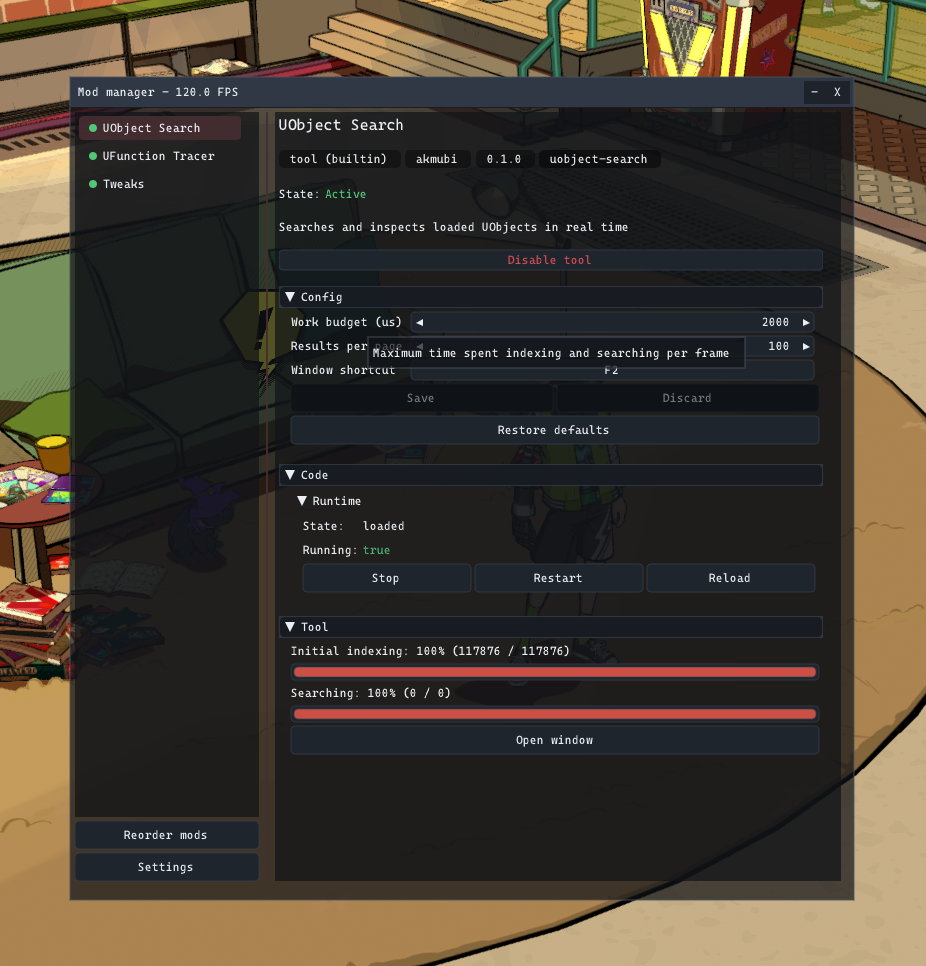
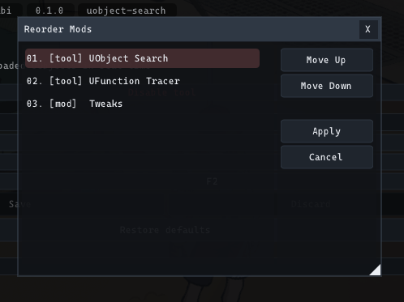
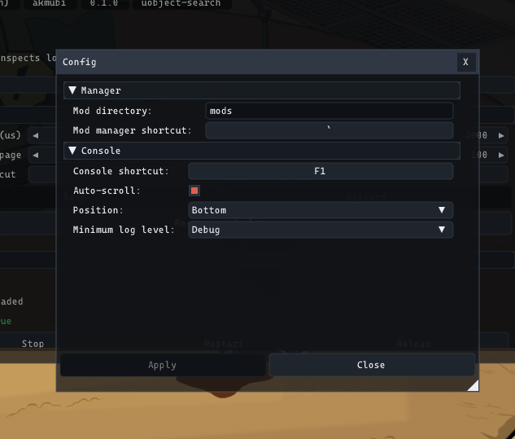
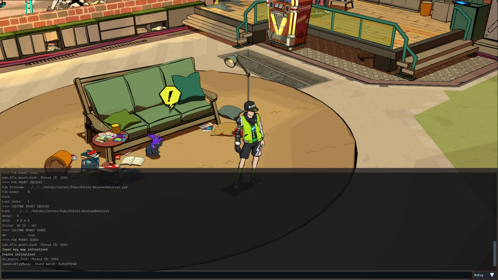
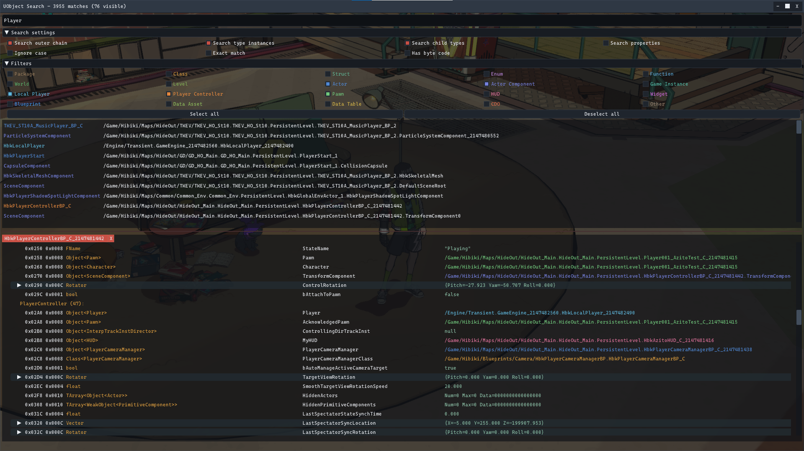
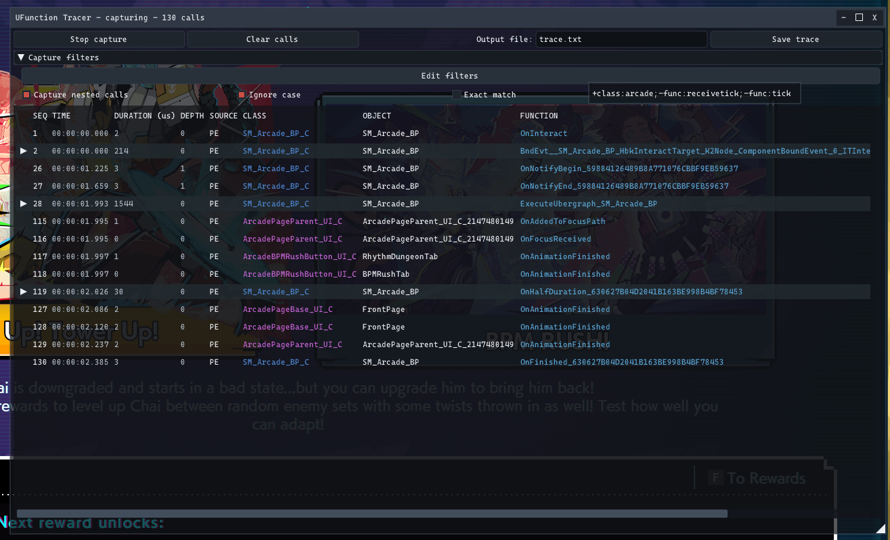

# Using Overdub

Overdub opens its windows on top of the game. The default shortcuts are backtick for the mod manager, F1 for the console, F2 for UObject Search, and F3 for UFunction Tracer. The shortcuts can be changed in Settings.

## Install a mod

Extract a mod into its own directory under `mods`. The directory must contain `mod.ini`.

```
mods/
+-- author.example/
    |-- mod.ini
    |-- config.ini
    |-- example.dll
    |-- scripts/
    |   +-- main.lua
    +-- assets/
```

Restart the game after adding or removing a mod. Overdub discovers packages and mounts assets during startup.

## Mod manager

Select a mod on the left to see its status and controls. A green status means that at least one part is active. Gray means inactive. Red means that something failed.



Enable and Disable control the complete mod. Native DLL and Lua code can be stopped while the game is running. Mounted assets cannot be safely removed, so asset changes still require a restart.

The Code section can start, stop, restart, or reload a native DLL. Reload is intended for development. It is safe only when the mod releases its hooks, callbacks, threads, and other external state before the DLL is unloaded.

The Config section edits options declared by a mod. Save writes the values to `config.ini`. Discard restores the last saved values. Restore defaults changes the current values to their defaults; use Save if those values should remain after restart.

Blueprint entries can be spawned or despawned from their section. A spawn can fail while the required world, pawn, controller, or other context does not exist.

## Mod order

Use Reorder mods to change startup order and asset priority, then restart the game. Runtime callbacks are processed in mod order. When asset packages conflict, a package later in the order normally has priority.



## Settings

Settings controls the mod directory, window shortcuts, console behavior, and other loader options. Press Apply to save changes. Changing the mod directory requires a restart.



## Console

The console shows messages from Overdub and mods. Commands registered by Overdub or a mod start with a colon.
```
:help
```

The `unreal` command sends the remaining text to Unreal's console command paths and prints captured text when the engine produces any:
```
:unreal stat fps
```

Some Unreal commands change state without printing output. Commands, console variables, and older `FExec` handlers do not all use the same engine path, so availability depends on the game build.

The UI console contains only the current session. Use `overdub.log` for startup errors and older messages.



## UObject Search

UObject Search inspects objects that are currently loaded. Search by name or type, select a result, and inspect its reflected properties and functions.

UFunction pages can open a call dialog. The dialog validates the target and input types, initializes reflected parameters, calls the function synchronously, and shows return and output values. This does not make arbitrary game functions safe. A function may change game state, destroy objects, or depend on context that the tool cannot infer.



## UFunction Tracer

UFunction Tracer records reflected calls that match its filters. Start with a narrow filter, begin capture, perform the action in game, and stop capture before inspecting the result.
```
+func:OnBeat
-func:Tick
```

An include rule starts with `+`. An exclude rule starts with `-`. Broad tracing can create a large amount of work and may slow the game.


